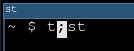

customcursor
============

Description
-----------
This patch adds a constant named `CUSTOM_BLOCK` to `config.def.h`,
allowing you to replace the snowman cursor with a custom one.

#### Example

`static unsigned int cursorshape = 7;`

`#define CUSTOM_BLOCK 0x003B /* semicolon (U+003B) */`

Download
--------
* [st-customcursor-20250405-98610fc.diff](st-customcursor-20250405-98610fc.diff)

Authors
-------
* Mertoalex Ashley - <mertoalex+suckless@disroot.org>
