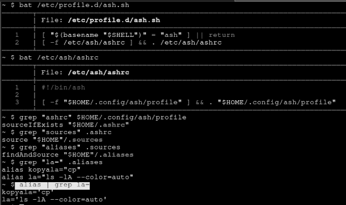

option
======

Description
-----------
This patch adds a variable called `option` to `config.def.h`,
allowing st to run the shell with an argument.

#### Example

`static char *shell = "/usr/bin/ash";`

`char *option = "-l";`

Now st runs `ash` with the `-l` argument, so `ash` starts as a login shell and sources
the `/etc/profile.d/` files.

Download
--------
* [st-option-20250404-98610fc.diff](st-option-20250404-98610fc.diff)

Authors
-------
* Mertoalex Ashley - <mertoalex+suckless@disroot.org>
